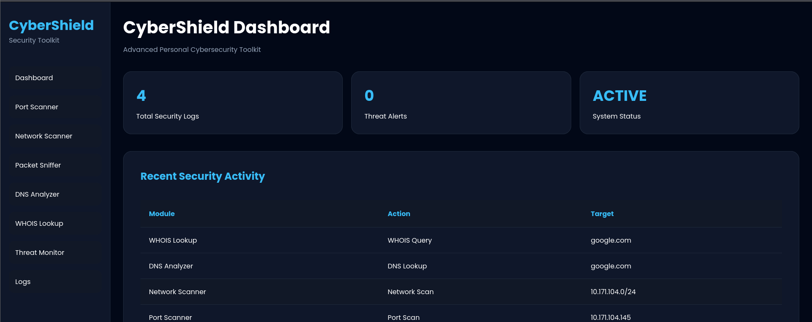
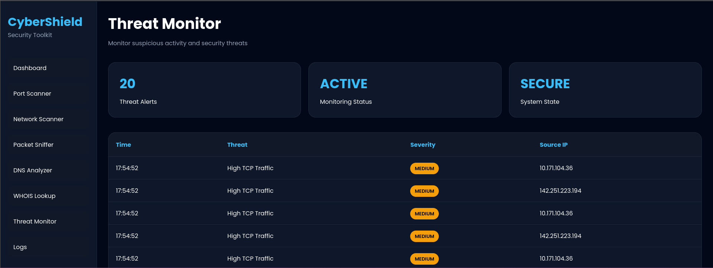
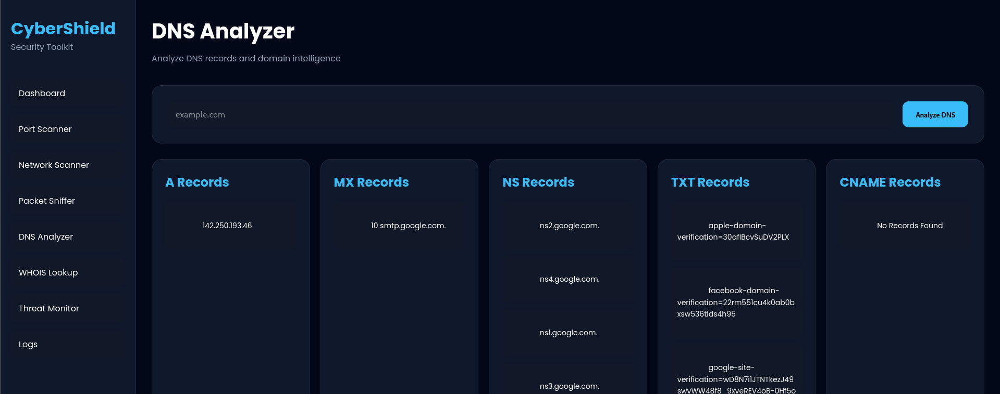

# 🛡️ CyberShield v1.0

Advanced Personal Cybersecurity Toolkit built using Flask, Python, and Networking Libraries.

---

# 📌 Overview

CyberShield is a multi-functional cybersecurity platform designed for:
- Network analysis
- Threat monitoring
- Packet inspection
- DNS intelligence
- WHOIS reconnaissance
- Security logging

The project combines multiple cybersecurity tools into one professional dashboard interface.

---

# 🚀 Features

## ✅ Dashboard
- Security overview
- Activity monitoring
- Threat summary
- Recent scan logs

---

## ✅ Port Scanner
- Scan open ports
- Detect active services
- TCP port analysis

---

## ✅ Network Scanner
- Discover connected devices
- Identify local network hosts
- Device monitoring

---

## ✅ Packet Sniffer
- Capture live packets
- Analyze TCP/UDP/ICMP traffic
- Real-time packet monitoring

---

## ✅ DNS Analyzer
- A Records
- MX Records
- TXT Records
- NS Records
- CNAME Records

---

## ✅ WHOIS Lookup
- Registrar information
- Domain expiration
- Domain creation date
- Name server analysis

---

## ✅ Threat Monitor
- High TCP traffic detection
- Suspicious IP activity
- Basic IDS functionality
- Real-time alert generation

---

## ✅ Logs System
- SQLite database
- Activity tracking
- Security event history
- Scan logging

---

# 🧠 Technologies Used

| Technology | Purpose |
|---|---|
| Python | Backend Logic |
| Flask | Web Framework |
| HTML/CSS | Frontend UI |
| Scapy | Packet Sniffing |
| Nmap | Port Scanning |
| SQLite | Database |
| DNSPython | DNS Analysis |
| Python-WHOIS | WHOIS Lookup |

---

# 📂 Project Structure

```bash
CyberShield/
│
├── app.py
├── requirements.txt
├── README.md
│
├── database/
│   ├── db.py
│   └── logs.db
│
├── scanner/
│   ├── port_scanner.py
│   ├── network_scanner.py
│   ├── packet_sniffer.py
│   ├── dns_analyzer.py
│   ├── whois_lookup.py
│   ├── threat_monitor.py
│   └── threat_data.py
│
├── static/
│   ├── css/
│   │   └── style.css
│   │
│   └── js/
│       ├── script.js
│       └── charts.js
│
└── templates/
    ├── layout.html
    ├── dashboard.html
    ├── port_scanner.html
    ├── network_scanner.html
    ├── packet_sniffer.html
    ├── dns_analyzer.html
    ├── whois_lookup.html
    ├── threat_monitor.html
    └── logs.html
```

---

# ⚙️ Installation

## 1️⃣ Clone Repository

```bash
git clone https://github.com/i-amshifa-06/CyberShield.git
```

---

## 2️⃣ Open Project

```bash
cd CyberShield
```

---

## 3️⃣ Install Requirements

```bash
pip install -r requirements.txt
```

---

## 4️⃣ Run Application

```bash
python app.py
```

---

# 🌐 Open In Browser

```text
http://127.0.0.1:5000
```

---

# 📸 Screenshots

## Dashboard



## Threat Monitor



## DNS Analyzer



---

# 🔐 Current Security Features

- Packet analysis
- Traffic monitoring
- Basic IDS detection
- Threat alert system
- DNS intelligence
- WHOIS reconnaissance
- Activity logging

---

# 🚧 Future Improvements

- Real-time WebSocket updates
- Live traffic graphs
- GeoIP attack tracking
- AI anomaly detection
- Login authentication
- Advanced IDS rules
- Threat scoring
- Export reports

---

# ⚠️ Disclaimer

This project is created for:
- Educational purposes
- Ethical cybersecurity learning
- Personal security research

Do NOT use this tool against systems without authorization.

---

# 👨‍💻 Author

Developed by:
**Shifaul Kareem**

---

# ⭐ CyberShield v1.0

A beginner-to-intermediate cybersecurity monitoring platform built with Python and Flask.
